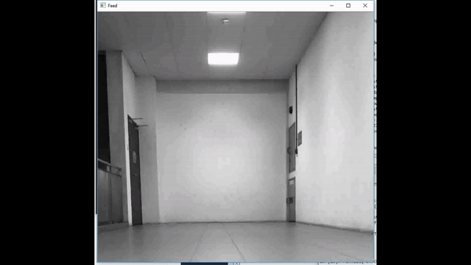

# Fall-Detection-Py-Raspberry
Running Python on Raspberry Pi3 to act as video cam for fall detection in Elderly Home
Althought the work is done on Raspberry, it can also work on Windows platform

Below is the instruction to install openCV in raspberry
	1. Install OpenCV 3.4.0 on Raspberry Pi 3 with Python 3.5.3
    https://www.youtube.com/watch?v=ZuhPzP5lt9U
	2. http://www.life2coding.com/install-opencv-3-4-0-python-3-raspberry-pi-3/

	3. Run this command in console to enable your raspberry video with openCV & python (required each time you boot up raspberry if you are using live video)
	sudo modprobe bcm2835-v4l2

Intro video: https://youtu.be/URcbJUne99E

